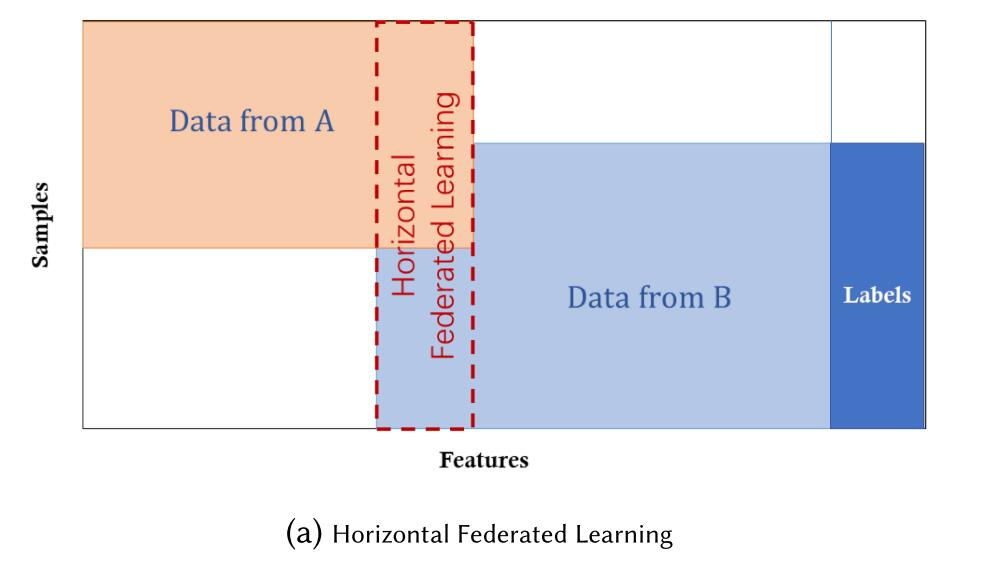

更新时间：2021/03/02

参考资料：github论文库[Awesome-Federated-Learning](https://github.com/chaoyanghe/Awesome-Federated-Learning)

## 0 wiki/blog上的联邦学习

参考资料：[wiki](https://en.wikipedia.org/wiki/Federated_learning)

下面是FL概述框图：

联邦学习指的是，在数据是分布式的情况下，各个服务器（或用户终端）不需要相互交换信息也可以完成模型训练的一种学习方式。注意，FL需要和分布式机器学习区别开，这两种学习方式的区别在于本地数据和最初的目标，分布式学习旨在并行运行算法以提升学习速度，其数据在各个计算机之间是共享的；而FL旨在用户之间不需要交互数据，或者用户之间的数据是异构的，并且FL中的终端是不可靠的，它可能是一部手机，一个IoT设备，而不是分布式学习中的数据中心。

FL分类：

- 集中式FL（Centralized federated learning）：使用一台中心服务器控制所有节点，并负责训练和融合接受到的模型更新请求
- 去中心式FL（Decentralized federated learning）：各节点自己获取全局模型，e.g. blockchain-based federated learning
- 异构FL（Heterogeneous federated learning）：指的是用户的数据是异构的，e.g. HeteroFL

### 0.1 FL round

FL学习是一种迭代学习，一次迭代可以被分解为一组client-server交互（原子操作），这被称为federated learning round

假设一次FL round仅由1次learning process组成，则该learning procedure可以由以下几步组成：

- initialization：选择ML模型，本地节点初始化
- client selection：部分本地节点（被选择）使用本地数据训练模型，获取当前统计模型，其余节点等待下次FL round
- configuration：中心服务器要求selected nodes使用预指定的方式开始训练。
- reporting：每个selected node发送本地模型以供服务器聚合，中心服务器聚合后，返回更新好的全局模型
- termination：当终止条件被满足，停止FL，中心服务器输出全局模型

### 0.2 算法参数

**Federated learning parameters**:

- Number of federated learning rounds: T
- Total number of nodes used in the process: K
- Fraction of nodes used at each iteration for each nodes: C
- Local batch size used at each learning iteration: B
- Number of iterations of local training before pooling: N
- Local learning rate: η

### 0.3 FL的性质（为什么需要FL）

**隐私**

在FL中，仅machine learning parameters会被交互，其余的数据仍存于本地，这使得数据泄露的风险大大降低，保护了数据隐私。并且，使用[homomorphic encryption](https://en.wikipedia.org/wiki/Homomorphic_encryption)方法可以在未解密的状态下进行运算，再次增加安全性。

**个性化**

**符合法律**

## 1 FL综述-笔记

参考资料：论文 Federated Machine Learning: Concept and Applications（Qiang Yang等. 2019）

### 1.1 Overview

#### 1.1.1 Definition of FL

设有N个用户
$$
\{F_1, ... , F_N\}
$$
每个用户拥有自己的数据D：
$$
\{D_1, ... , D_N\}
$$
他们想使用这些数据完成一次机器学习模型的训练，传统的机器学习中，模型训练的输入为全部数据，即input D, output M_sum；而在FL中，每个用户F_i在不暴露自己的数据D_i的情况下，同样可以output初M_fed。两种模型的准确度由V_FED, V_SUM表示，若：
$$
|V_{FED} - V_{SUM}|<δ
$$
则我们称之为，联邦学习算法有δ的精度损耗。

#### 1.1.2 Privacy

此章节review一些不同的FL隐私保护技术，并比较

**Secure MultipartyComputation (SMC)**：在SMC中，每个用户（party）仅知道自己的输入和输出，对其余的信息一无所知，属零知识技术。但此技术需要**复杂**的计算，并且该算法并不能**高效**的实现。该算法允许将部分知识公开，也可以降低安全性以提高运行效率。相关前沿研究（应用于FL）请参阅论文2.2节。

**Differential Privacy**：或称为k - anonymity，其手法为在data内加入噪声，或使用generalization方法来令敏感信息模糊化。然而，该方式仍需要让信息传递到其他地方，并多数算法中精度和隐私性是不可兼得的。相关前沿研究（应用于FL）请参阅论文2.2节。

**Homomorphic Encryption**：该方式通过加密交换中的参数以保护数据，与differential privacy protection的区别是，数据和model本身不被传送，也不能被第三方使用部分数据猜测出来，这意味着原始数据是不易泄露的。相关前沿研究（应用于FL）请参阅论文2.2节。

##### 1.1.2.1 间接信息泄露

早期的FL学习过程中，中间结果（如stochastic gradient descent. SGD）是暴露给其他用户的，但这一暴露行为并没有得到安全批准，重要的是，gradients的泄露会暴露部分重要数据信息，例如image pixels（图像像素）。攻击者可以利用这一漏洞，在他人数据中插入后门（back door），甚至可以在全局模型中插入后门。

因此，研究人员开始考虑使用区块链（blockchain）作为FL平台，相关前沿研究（应用于FL）请参阅论文2.2.1节。

### 1.2 FL分类（Categorization）- 基于数据的分布式特性

数据由矩阵表示，row代表样本，column代表特征。有些dataset使用三维矩阵，X为feature space，Y为label space，I为ID space。此论文中，FL被分为横向FL、纵向FL和联邦迁移学习（基于feature和sample ID分布特征）。

#### 1.2.1 Horizontal Federated Learning（横向联邦学习）

又称为sample-based FL，指datasets中feature space相同，samples不同。例如，两个银行拥有不同的客户群体（samples），二者客户的交集很小，但银行业务（feature）却是相似的。

横向联邦学习可以表示为，
$$
X_i=X_j, Y_i=Y_j,I_i≠I_j
$$
在横向联邦学习系统中，通常假设参与者是诚实的，安全性是针对那些honest-but-curious的服务器，即只有服务器会危害用户数据的隐私性。此类型FL算法请见论文2.3.1节。

#### 1.2.2