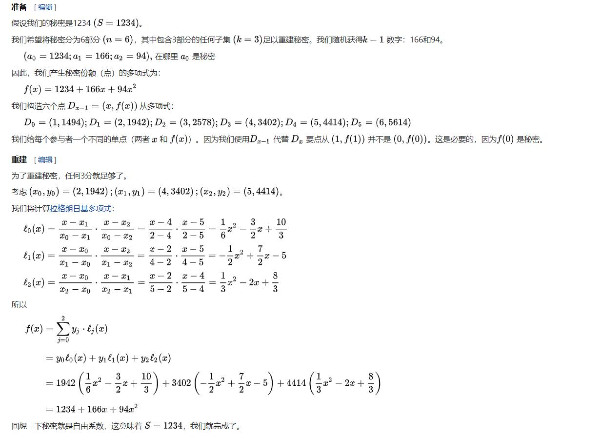

更新时间：2021/03/08

参考资料：

- [Paper: Practical Secure Aggregation for Privacy-Preserving Machine Learning](https://dl.acm.org/doi/10.1145/3133956.3133982)

前置知识：

- [神经网络和深度神经网络](https://www.cnblogs.com/subconscious/p/5058741.html)

# 1 Overview

使用同态加密的方法，使parties之间的信息不会被泄露。

# 2 Cryptographic Primitives（加密原语）

## 2.1 Secret Sharing

使用Shamir’s t-out-of-n Secret Sharing方法，该方法将secret *s*分成*n*个shares，任意t个shares可以重构s，小于t个shares则无法还原s，且得不到任何信息。

加密算法简述：
$$
使用整数1-n表示用户编号，明文为s，则share\ s_u可使用函数：\\SS.share(s,t,U)得出，\\其中t≤|U|,各个用户编号u∈U
$$
一个例子：

